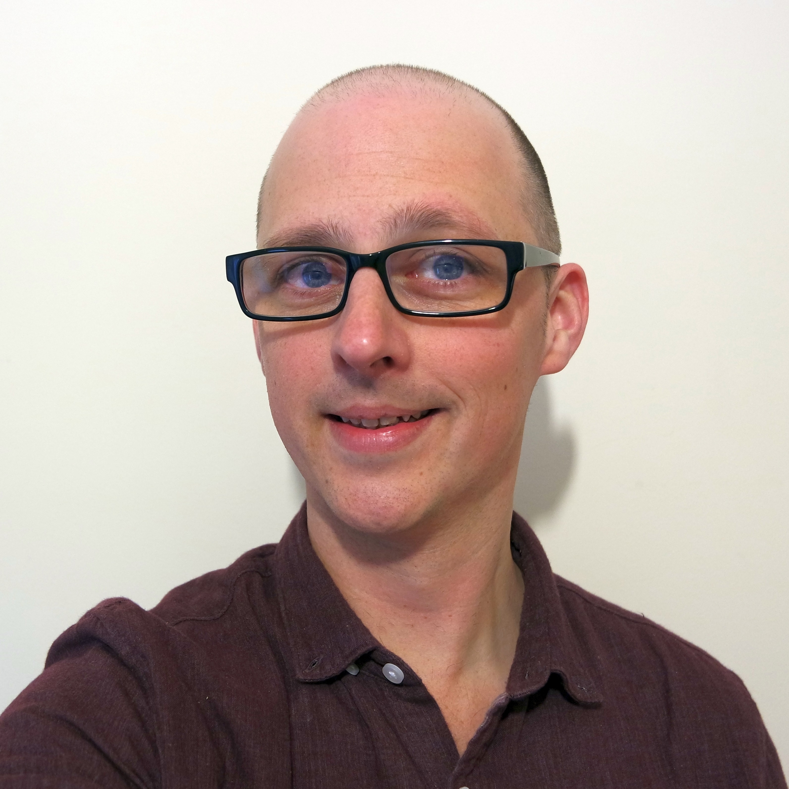

	

		Information about my <a href="/research">research</a>, <a href="/teaching">teaching</a> and <a href="/publications">publications</a> can be found elsewhere. Here you will find a little bit more information about my background. Feel free to <a href="/contact">contact me</a> if you wish to know more.
	

	
	

		

			
<b>Education</b>

			<ul>
				<li>University</li>
					<table>
						<tr>
							<td>2004-2008:</td> 
							<td>PhD in Mathematical Physics at <a href="https://www.lancaster.ac.uk">Lancaster University</a>.  Thesis: ''The Electrodynamics of Moving, Elastic Media''.  Supervisor: <a href="https://www.lancaster.ac.uk/physics/about-us/people/robin-tucker">Prof. Robin W. Tucker</a></td>
						</tr>
						<tr>
							<td>2000-2004:</td> 
							<td>First class MSci degree in Theoretical Physics with Applied Mathematics at <a href="https://www.lancaster.ac.uk">Lancaster University</a>. 
							Taught jointly with Departments of <a href="https://www.lancaster.ac.uk/physics/">Physics</a> and <a href="https://www.lancaster.ac.uk/maths/">Mathematics</a>.  
							Modules studied on the degree can found <a href="MSciModules.html">here</a>.</td>
						</tr>
					</table>
				<li>A Levels</li>
					

						Gained from Downham Market Sixth Form, Norfolk 
					

					<table  style="width:50%;">
						<tr>
							<td>Maths:</td>
							<td>A</td>
						</tr>
						<tr>
							<td>Further Maths:</td>
							<td>B</td>
						</tr>
						<tr>
							<td>Physics:</td>
							<td>A</td>
						</tr>
					</table>
					

						Achieved Norfolk Scholar status.
					

			</ul>
		

		

		

			
<b>Previous Employment</b>

			<ul>
				<li>Lecturer in Mathematics, <a href="https://www.bolton.ac.uk">"University of Bolton</a></li>
					<table>
						<tr>
							<td>2014-2021:</td> 
							<td><ul style="margin-left: 0px; padding-left: 10px;">
									<li>Position held in the Department of Mathematics, initially as an Associate Lecturer and then promoted to full Lecturer in 2016. </li>
								
									<li>The role involved teaching, pastoral and tutorial support to students on a variety of undergraduate courses from HE3–HE7 level across the School of Engineering.</li>
								
									<li>The position also promoted continuing research and the development of an outreach programme for the department.</li>
									<li>A list of modules taught can found <a href="../teaching">here</a>.</li>
								</ul>
							</td>
						</tr>
					</table>
				<li>Research Associate, <a href="https://www.lancaster.ac.uk">Lancaster University</a></li>
					<table>
						<tr>
							<td>2007-2014:</td> 
							<td><ul style="margin-left: 0px; padding-left: 10px;">
									<li>Research position within the Industrial Mathematics and Gravity Group (IMGG). </li>
								
									<li>Utilised differential geometric and analytic techniques to solve electrodynamic problems at a classical and quantum level, for applications from plasma dynamics to nanotechnology.</li>
									
									<li> Wrote bespoke routines in MAPLE and MATLAB to solve a range of physical and mathematics problems, specifically developing a differential geometric package (Manifolds) for MAPLE. </li>
																	
									<li>Worked as part of the <a href="https://www.cockcroft.ac.uk">Cockcroft Institute</a> and the <a href="https://alpha-x.phys.strath.ac.uk/">ALPHA-X</a> collaboration.</li>
									<li>A list of modules taught can found <a href="../teaching">here</a>.</li>
								</ul>
							</td>
						</tr>
					</table>
			</ul>
		

		

		

			
<b>Selected Seminars & Outreach</b>

			<table>
				<tr>
					<td>2018:</td> 
					<td>'Through the Looking-Glass, and What Abraham-Minkowski Found There ', University of the Third Age (U3A), Bury. </td>
				</tr>
				<tr>
					<td>2016:</td> 
					<td>'Exploring Infinity'. Curious? Futures Festival, Kings Cross London.  An event where I helped guide arts students from <a href="https://www.arts.ac.uk/colleges/central-saint-martins">Central Saint Martins</a> to create an installation discussing notions of infinity through their work.</td>
				</tr>
				<tr>
					<td>2015:</td>
					<td><ul style="margin-left: 0px; padding-left: 10px; list-style-type:circle">
							<li>'What do Geckos know about Quantum Physics?', TIRI Conference, University of Bolton.</li>
							<li>'Science Slam', Manchester Science Festival.>br> An event coupling scientists with poets to create and perform 'science poetry' in order to explain complex ideas through spoken word.  </li>
							<li>'Science Showoff', Museum of Science & Industry, Manchester.  A group of scientists are given 15 minutes to discuss their work to entertain and educate a general audience.</li>
						</ul>
					</td>
				</tr>
				<tr>
					<td>2011:</td>
					<td>'The Electrodynamics of Inhomogeneous Rotating Media', Problems and Developments of Classical Electrodynamics, Bad Honnef, Germany</td>
				</tr>
				<tr>
					<td>2009:</td>
					<td>'An Intrinsic Approach to Forces on Polarisable Media', Fifth Workshop on Advanced Computational Electromagnetics, Academia dei Lincia, Rome</td>
				</tr>
				<tr>
					<td>2008:</td>
					<td>'Forces on Polarisable Media'. Invited to talk at the symposium: ''The Push or Pull of Optical Momentum?'', Grasmere.</td>
				</tr>
			</table>
		

		
		

		
		

			
<b>Selected Achievements</b>

			<table>
				<tr>
					<td>2020:</td> 
					<td>Winner of University of Bolton Student-led Teaching Award 2020.</td>
				</tr>
				<tr>
					<td>2018:</td> 
					<td>Passed an HEA/AHE-accredited postgraduate module (HE7 level): ''Research Degree Supervision'' at the University of Bolton with a mark of 78%.</td>
				</tr>
				<tr>
					<td>2016:</td>
					<td>The ''The Dynamics of Compact Laser Pulses'' which I co-authored was highlighted in <a href="https://www.europhysicsnews.org">Europhysics News.</a></td>
				</tr>
				<tr>
					<td>2014:</td> 
					<td>Successfully completed a Higher Education Academy (HEA) accredited ''Supporting Learning Programme'' at Lancaster University, leading to becoming an Associate of the HEA and gained a Staff & Educational Development Association (SEDA) Supporting Learning Award.</td>
				</tr>
				<tr>
					<td>2012:</td>
					<td>The paper ''Exploring Born-Infeld Electrodynamics using Plasmas'' which I co-authored and based in part on my PhD thesis was selected as a 'Highlight of 2011' by the <a href="https://www.iop.org">Institute of Physics</a>.</td>
				</tr>
				<tr>
					<td>2011:</td>
					<td>Successfully completed a course on 'Science Communication' run by the <a href="https://www.stem.org.uk/">National Science Learning Centre.</a>.</td>
				</tr>
				<tr>
					<td>2005:</td>
					<td>Local organiser for GCM7 - the Seventh International conference on Geometry, Continua and Microstructure, held at Lancaster University.</td>
				</tr>	
			</table>
		

		
		

		
		

			
<b>Other Interests</b>

			<ul style="margin-left: 20px; padding-left: 20px; list-style-type:circle">
				<li>Coffee!
					

						<b>Current favourite coffee shop</b>: <a href="http://www.alltheshapes.co.uk/">All The Shapes</a>, Prestwich.
					

				</li>
				<li>Cooking, especially Japanese food.
					

						<b>Current signature dish</b>: <a href="https://en.wikipedia.org/wiki/Jiaozi">Japanese gyoza</a>.
					

				</li>
				<li>Reading, especially science fiction. 
					

						<b>Current favourite book</b>: '<a href="https://en.wikipedia.org/wiki/Kleinzeit">Kleinzeit</a>', <a href="https://en.wikipedia.org/wiki/Russell_Hoban">Russell Hoban </a> 
					

				</li>
				<li>Films, watching and making (especially with my children).  
					

						<b>Current favourite film</b>: '<a href="https://en.wikipedia.org/wiki/Hana-bi">Hana-bi</a>' (dir: <a href="https://en.wikipedia.org/wiki/Takeshi_Kitano">Takeshi Kitano</a>) 
					

				</li>
				<li>Music, especially jazz.  
				(I also play bass guitar, though only very occasionally these days!)
					

						<b>Current favourite album</b>: '<a href="https://en.wikipedia.org/wiki/Promises_(Floating_Points,_Pharoah_Sanders_and_the_London_Symphony_Orchestra_album)">Promises</a>', <a href="https://en.wikipedia.org/wiki/Floating_Points">Floating Points</a>, <a href="https://en.wikipedia.org/wiki/Pharoah_Sanders">Pharoah Sanders</a> & <a href="https://en.wikipedia.org/wiki/The_London_Symphony_Orchestra">The London Symphony Orchestra</a>
					

				</li>
				<li>Walking and cycling, especially with my family.
					

						<b>Current favourite walk</b>: Any new city explored via <a href="https://www.treasuretrails.co.uk/">Treasure Trails.</a>
					
</li>
			</ul>
		

		
	

	

		

			
		

	

 

